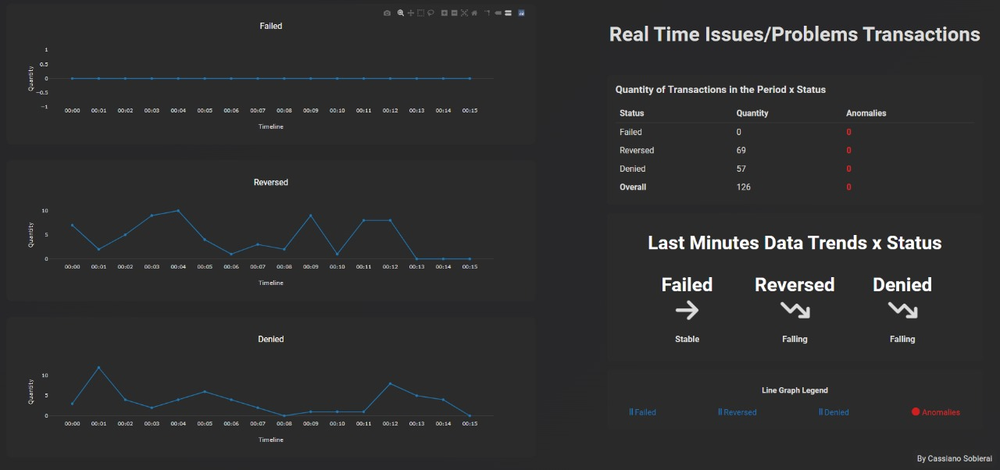

# Monitoring analyst case

> “Where there is data smoke, there is business fire.” — 
Thomas Redman.<br/>

## 1. Introduction

This test was given by a brazilian company for a job interview.

The challenges were created with the aim of helping the candidate build the knowledge base needed to implement 
the technical assessment in the end!

- The first challenge is an analysis of hypothetical data.
- The second challenge is the actual implementation of a solution to a real world problem. 

## 2. Pre-requisites

- The required Python libraries to run the development are below. Use `pip install <name of library>` to install all dependencies.

```bash
pip install Flask
pip install numpy
pip install pandas
pip install apscheduler
pip install pymsteams
pip install scikit-learn
```

## 3. Tasks

### 3.1 - Get your hands dirty

Using [this csv](https://github.com/cassisob/Monitoring-System-Activity/blob/main/checkout_1.csv)
and using [this csv](https://github.com/cassisob/Monitoring-System-Activity/blob/main/checkout_2.csv)
 with hypothetical checkout data, imagine that you are trying to understand if there is any kind of anomaly behavior.

1. Analyze the data provided and present your conclusions .
2. In addition to the spreadsheet data, make a query in SQL and make a graphic of it and try to explain the anomaly behavior you found.
3. In this csv you have the number of sales of POS by hour comparing the same sales per hour from today, yesterday and the average of other days. So with this we can see the behavior from today and compare to other days

### 3.2 - Solve the problem

*Alert incident in transactions: Implement the concept of a simple monitoring with real time alert with notifications to teams.*

The monitoring works by receiving information about a transaction and inferring whether it is a failed or denied, or reversed or aprroved transaction. 
We work mostly with SQL, PromQL, Ruby and Python, but you can use any programming language that you want. 

Please use the data of [this csv](https://github.com/cassisob/Monitoring-System-Activity/blob/main/transactions_1.csv)
and the data of [this csv](https://github.com/cassisob/Monitoring-System-Activity/blob/main/transactions_2.csv). 
Consider that transactions with the flag ```denied``` are transactions denied by risk of the issuers.
Consider that transactions with the flag ```reversed or failed``` are transactions with problems.
Note: F1 represents the quantity of transactions per minute from all pos from our costumers. So with this data you can see the diferent status per minute and see if it is going well or not. When you see the padron, you can predict a alarm for the anomaly.

Your Monitoring alert system must have at least:
1 endpoint that receives transaction data and returns a recommendation to “alert” the anomalies found in transactions.
A query to organize the data on the data and a graphic to see the data in real time.
A model to determine anomalies and a system to report the anomalies automatically.

You are free to determine the methods to approve/deny the transactions, but a few ways to do it are:

- rule-based  - you define which cases get alerted based on predefined rules;
- score-base  - you create a method/model (you could use machine learning models here if you want)  to determine the anomaly
-- score of a transaction and make your decision based on it; 
- a combination of both;
 
#### Monitoring alert Requirements

- Alert transactions if failed transactions are above normal;
- Alert transactions if reversed transactions are above normal;
- Alert transactions if denied transactions are above normal;

## 4. Deliverable

- The results of the test are in the "Presentation.pptx" file where is a general view of everything, the "activity_1.pynb" file, and the "activity_2" folder contains the "making process".


